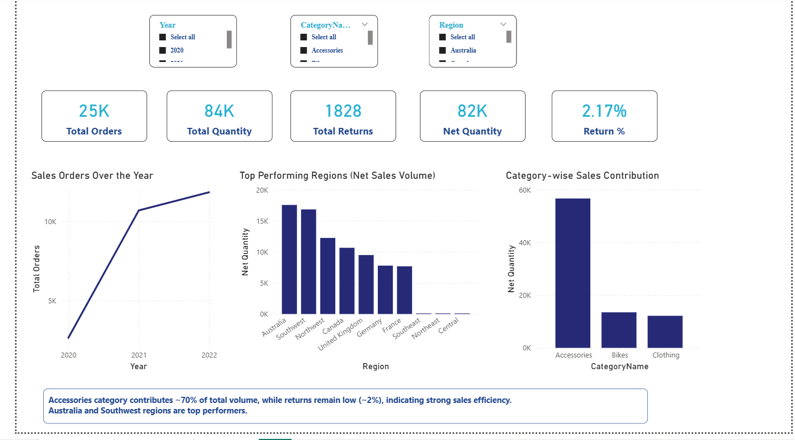
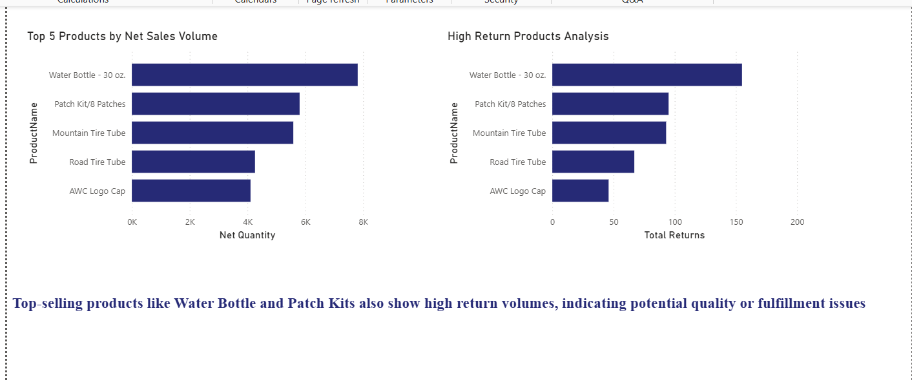
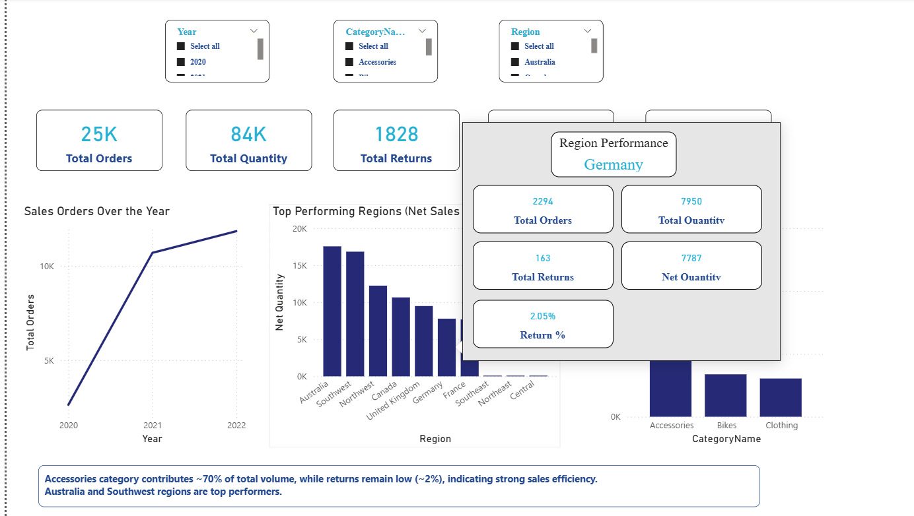
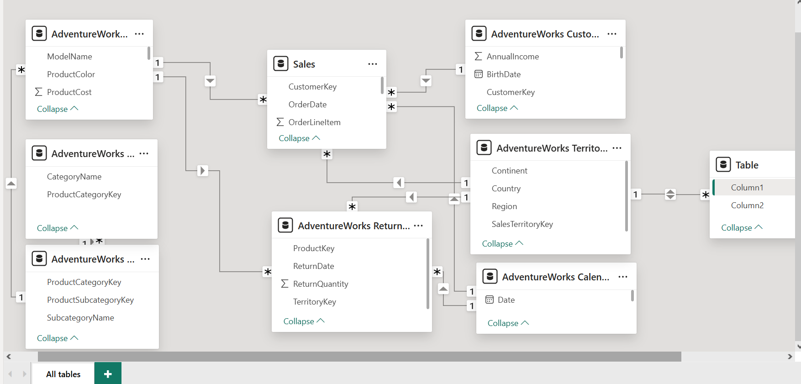

# Retail-Sales-PowerBI-Dashboard
An end-to-end Power BI project focused on analyzing retail sales performance, identifying high-return products, and enabling secure, role-based access using Dynamic Row Level Security (RLS).
This dashboard helps stakeholders make data-driven decisions through interactive visuals, KPI tracking, and advanced tooltip UX.

## Project Overview
This project analyzes retail sales data to uncover insights on sales performance, returns, and regional trends.
The dashboard provides a clear view of
- Sales growth over time
- Top-performing regions
- Category contribution
- Product-level performance
- Return behavior

## Project Workflow
- Imported retail dataset into Power BI
- Performed data cleaning and transformation
- Built star schema data model
- Created DAX measures for KPIs
- Designed interactive dashboard visuals
- Implemented tooltip for better UX
- Applied Dynamic Row Level Security (RLS)

## Business Problem
- Retail businesses often struggle to:
- Identify high-return products
- Track regional performance
- Understand sales vs returns impact

This dashboard helps stakeholders make data-driven decisions by highlighting key patterns.
## Key Insights
- Accessories dominate sales (~70% contribution), indicating strong demand concentration in a single category
- Return percentage remains low (~2%), indicating efficient sales
- Certain top-selling products also have higher returns
- Regions like Australia and Southwest perform strongly

## Features Implemented
- KPI Cards (Total Orders, Quantity, Returns, Net Quantity, Return %)
- Dynamic filtering using slicers (Year, Category, Region)
- Region-wise performance analysis
- Category contribution analysis
- Top-performing products visualization
- Custom tooltip for detailed hover insights
- Dynamic Row Level Security (RLS)

## Interactive Visuals
- Sales trend over time
- Region-wise performance
- Category contribution
- Top 5 products
- Tooltip (Advanced UX)

## Custom tooltip showing:
- Total Orders
- Total Returns
- Return % on hover over regions
- Row Level Security (RLS)

## Dynamic RLS implemented using:
Dynamic RLS implemented using USERPRINCIPALNAME()

A mapping table is used to restrict users to their respective regions, ensuring:
- Secure data access
- Personalized data views
- Scalable user-based filtering

Also handled scenario where specific users can access multiple regions.

## Dashboard Views
### Overview Dashboard

### Deep Dive Analysis

### Tooltip Experience (Advanced UX)

## Data Model

## Tools Used
- Power BI
- DAX
- Data Modeling
- GitHub (for project documentation)

## Learnings
- Implemented dynamic Row Level Security using DAX
- Designed user-friendly tooltip for better UX
- Built a structured data model for performance optimization
- Translated business problems into actionable insights
